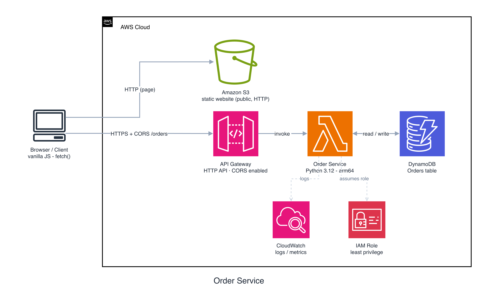

# Serverless Applications with AWS Lambda

A small demo project that builds the **Order Service** — one microservice of a
restaurant application — end to end with the AWS CDK: **API Gateway → Lambda →
DynamoDB**, plus a static frontend hosted on S3.

## The Order Service

This demo builds **one microservice**, the **Order Service**, of a larger
restaurant application. A full app would also have Menu, Payments, and Kitchen
services; here we build only this one, end to end.



The page is hosted on a **public S3 static website** (HTTP), and the API is a
separate **API Gateway → Lambda → DynamoDB** path. Because the page (S3, `http`)
and the API (`execute-api`, `https`) live on **different origins**, the browser
makes a cross-origin request, so the HTTP API enables **CORS**, and the page
learns the API's address from a small `config.js` that CDK generates at deploy
time (it sets `API_BASE` to the real `ApiUrl`).

```
Browser ──HTTP───►  S3 static website (public)        # the page
        └─HTTPS──►  API Gateway ─► Lambda ─► DynamoDB  # /orders (CORS enabled)
```

> No CloudFront here; it's an optional "polished production" layer. Trade-offs:
> the website endpoint is **HTTP-only** (no HTTPS) and the bucket is **public**,
> and because the page and API are cross-origin, the HTTP API enables **CORS**.

- `POST /orders`: create an order (returns 201 + the created order)
- `GET /orders`: list all orders (returns 200 + array)

### Project layout

```
app.py                                       # CDK app entry point
cdk.json                                     # CDK config + feature flags
requirements.txt                             # Python dependencies (CDK + test)
stacks/order_service_stack.py                # CDK stack: DynamoDB + Lambda + HTTP API (CORS) + public S3 website
lambda_functions/order_service/handler.py    # the Lambda handler (thin routeKey router)
web/index.html                               # vanilla-JS frontend (calls API_BASE + /orders)
scripts/deploy.sh, scripts/delete.sh         # one-command deploy / teardown
scripts/api.http                             # curl snippets
tests/unit/                                  # pytest (handler via moto, stack via assertions)
```

## Prerequisites

- AWS CLI configured with credentials (`aws sts get-caller-identity` works)
- Node.js + the CDK CLI (`npm install -g aws-cdk`)
- Python 3.12

## Deploy

The fastest path is the script; it bootstraps, deploys, and uploads the
frontend (plus the generated `config.js`) to the S3 website bucket:

```bash
python -m venv .venv && . .venv/bin/activate
pip install -r requirements.txt
./scripts/deploy.sh
```

Or run the CDK steps yourself:

```bash
cdk bootstrap          # one-time per account/region
cdk deploy             # prints SiteUrl and ApiUrl
```

When it finishes, open the **`SiteUrl`** (the S3 website endpoint, `http://…`) in
your browser. CDK writes a `config.js` next to the page that sets `API_BASE` to
the deployed `ApiUrl`, so the page calls the API cross-origin (CORS is enabled on
the API).

## Teardown

```bash
./scripts/delete.sh          # or: cdk destroy
```
